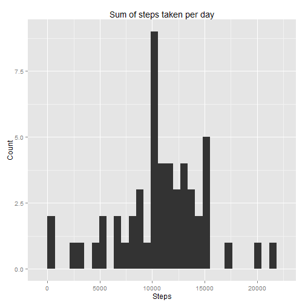
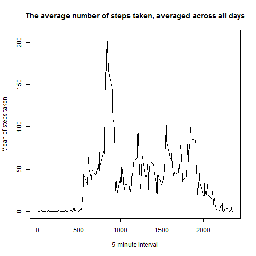
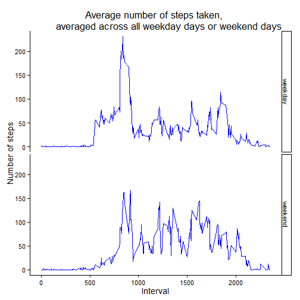

## Loading and preprocessing the data

```r
#load necessary libraries:
library(lubridate)
library(xtable)
library(ggplot2)
library(dplyr)
library(knitr)
```

Reading in data:

```r
#data have to be in working directory:
a<-read.csv("activity.csv")
```


## What is mean total number of steps taken per day?

1. Calculate the total number of steps taken per day

```r
a_agg<-aggregate(steps ~ date, data=a, sum)
```

2. Make a histogram of the total number of steps taken each day

```r
ggplot(a_agg, aes(steps)) + geom_histogram()
```

 

3. Calculate and report the mean and median of the total number of steps taken per day

```r
a_m<-as.data.frame(cbind(mean(a_agg$steps), median(a_agg$steps)))
names(a_m)<-c("Mean", "Median")
print(xtable(a_m), type="html")
```

<!-- html table generated in R 3.2.1 by xtable 1.7-4 package -->
<!-- Tue Oct 13 19:42:48 2015 -->
<table border=1>
<tr> <th>  </th> <th> Mean </th> <th> Median </th>  </tr>
  <tr> <td align="right"> 1 </td> <td align="right"> 10766.19 </td> <td align="right"> 10765.00 </td> </tr>
   </table>


## What is the average daily activity pattern?

1. Make a time series plot (i.e. type = "l") of the 5-minute interval (x-axis) and the average number of steps taken, averaged across all days (y-axis)

```r
#create dataset with means of steps of each interval:
d<-filter(a, !is.na(steps)) %>%
        group_by(interval) %>%
        summarize(AvgSteps = mean(steps))

#plot time series plot:
plot(AvgSteps ~ interval, data=d, type="l", 
     xlab="5-minute interval", ylab="Mean of steps taken",
     main = "The average number of steps taken, averaged across all days")
```

 

2. Which 5-minute interval, on average across all the days in the dataset, contains the maximum number of steps?

```r
d$interval[max(d$AvgSteps)]
```

```
## [1] 1705
```


## Imputing missing values

1. Calculate and report the total number of missing values in the dataset (i.e. the total number of rows with NAs)

```r
sum(is.na(a$steps))
```

```
## [1] 2304
```
  

2. Devise a strategy for filling in all of the missing values in the dataset.

- *compute mean for each interval and store in a dataframe - already done in previous question (object "d")*
- *identify days with NAs*
- *fill in days with NAs with table created in step one*  

3. Create a new dataset that is equal to the original dataset but with the missing data filled in.

```r
#compute mean for each interval and store in a dataframe - already done:
d
```

```r
#identify days with NAs:
a_NAs<-group_by(a, date) %>% summarize(NoNAS=sum(is.na(steps)))
a_day<-a_NAs$date[a_NAs$NoNAS > 0]
#after visual inspection I noticed that NAs are only for whole days, no mixed data for any day

#fill in NAs with table d:
f <- a
f$steps[is.na(f$steps)] <- rep(d$AvgSteps, length(a_day))

#look if the values were filled correctly:
#just probe values of first, middle and last day, if all true, then the filling went right and the dataset f is correct
all(d$AvgSteps == f$steps[f$date == a_day[1]])
all(d$AvgSteps == f$steps[f$date == a_day[5]])
all(d$AvgSteps == f$steps[f$date == a_day[8]])
```

```
## [1] TRUE
## [1] TRUE
## [1] TRUE
```

4. Make a histogram of the total number of steps taken each day and Calculate and report the mean and median total number of steps taken per day. Do these values differ from the estimates from the first part of the assignment? What is the impact of imputing missing data on the estimates of the total daily number of steps?

```r
#aggregate and plot data:
f_agg<-aggregate(steps ~ date, f, sum)
ggplot(f_agg, aes(steps)) + geom_histogram()
```

 

```r
#calculate mean and median and compare with a_m:
a_m<-rbind(a_m, (c(mean(f_agg$steps), median(f_agg$steps))))
rownames(a_m)<-c("with_NAs", "filled_in")
print(xtable(a_m), type="html")
```

<!-- html table generated in R 3.2.1 by xtable 1.7-4 package -->
<!-- Tue Oct 13 19:42:49 2015 -->
<table border=1>
<tr> <th>  </th> <th> Mean </th> <th> Median </th>  </tr>
  <tr> <td align="right"> with_NAs </td> <td align="right"> 10766.19 </td> <td align="right"> 10765.00 </td> </tr>
  <tr> <td align="right"> filled_in </td> <td align="right"> 10766.19 </td> <td align="right"> 10766.19 </td> </tr>
   </table>
- *As seen from the table, in this case the impact is none, filling in the averaged data has no effect compared to simple omission of missing data. However, this cannot and should not be generalized, this case is very special one, as the missing data are only for whole days. Such a case is not usual in real data.*


## Are there differences in activity patterns between weekdays and weekends?

1.Create a new factor variable in the dataset with two  levels – “weekday” and “weekend” indicating whether a given date is a weekday or weekend day.

```r
#library(lubridate) to get correct format of dates for weekdays():
f$day<-ymd(f$date)

#extract week days and put them in working dataset:
dny<-weekdays(f$day)
f_day<-f
f_day$dny <- dny


#set days to factor with two levels (weekday and weekend):
#please notice that my days are in my language because I cannot change system locale to english speaking, tho it is not a problem
f_day$weekday[f_day$dny== "sobota"] <-"weekend"
f_day$weekday[f_day$dny == "neděle"] <-"weekend"
f_day$weekday[f_day$dny == "neděle"] <-"weekend"
f_day$weekday[f_day$dny == "pondělí"] <-"weekday"
f_day$weekday[f_day$dny == "úterý"] <-"weekday"
f_day$weekday[f_day$dny == "středa"] <-"weekday"
f_day$weekday[f_day$dny == "čtvrtek"] <-"weekday"
f_day$weekday[f_day$dny == "pátek"] <-"weekday"

#check that there are only two levels::
table(f_day$weekday)
```

```
## 
## weekday weekend 
##   12960    4608
```

2.Make a panel plot containing a time series plot (i.e. type = "l") of the 5-minute interval  (x-axis) and the average number of steps taken, averaged across all weekday days or weekend days (y-axis). 


```r
#calculate mean of steps in interval of weekdays or weekends:
m<- group_by(f_day, weekday, interval) %>%
    summarize(meanWeek = mean(steps))

#time series plot:
ggplot(m, aes(x=interval, y=meanWeek, group=weekday)) +
    geom_line(color="blue") + facet_grid(weekday~.) +
    labs(title="Average number of steps taken, 
         averaged across all weekday days or weekend days", 
         x="Interval", y="Number of steps") +
    theme_classic(base_size = 14, base_family = "")
```

 
